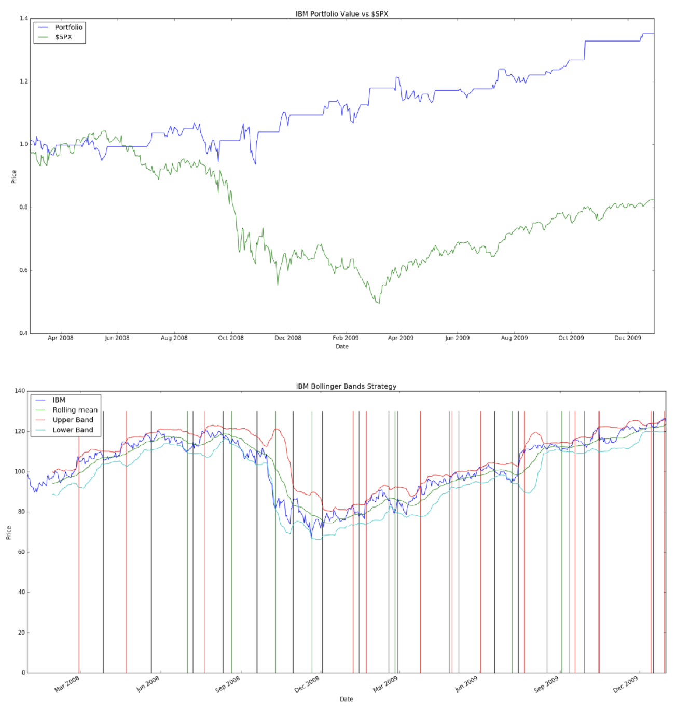
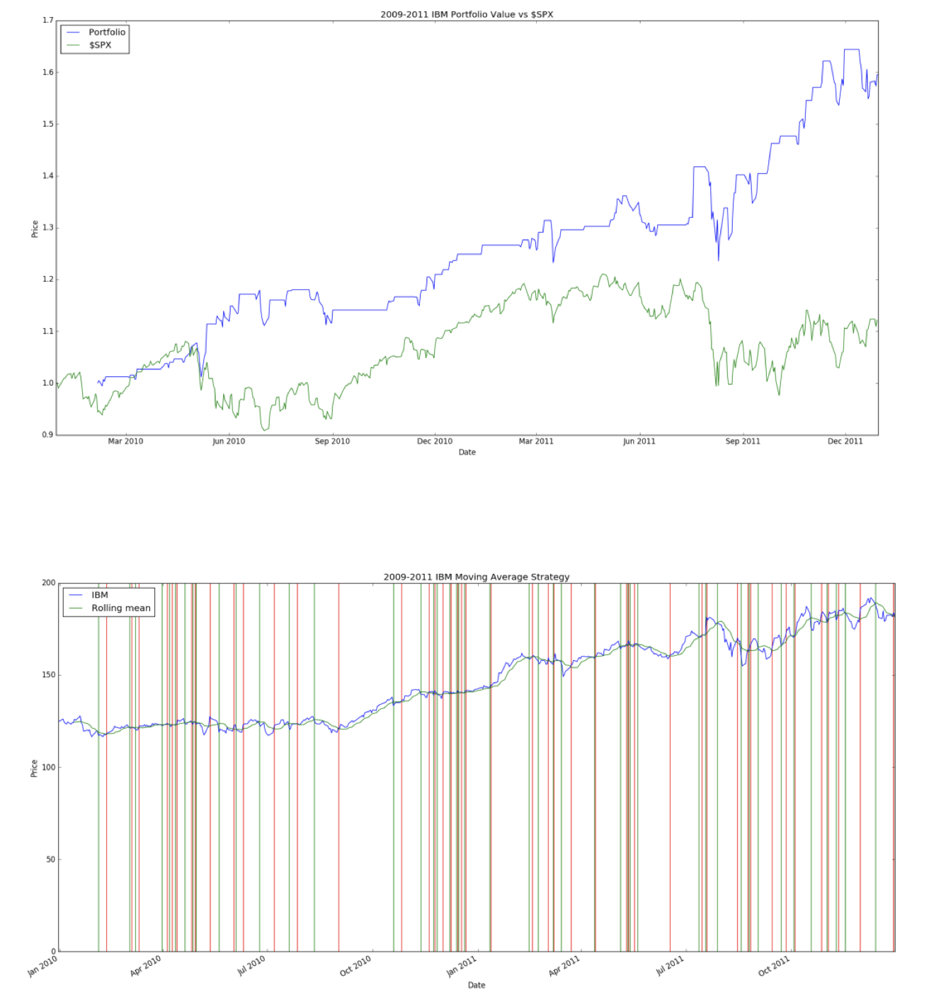

# Stock-Trading-Strategies

Implemented a stock trading algorithms using technical indicators such as moving average and Bollinger bands.
Implemented trading strategies using Python with Numpy and Pandas. 

#Results
Key: Green line – long, Red line – short, Black line - stop

****

**Bollinger Strategy** 
Date Range: 2008-02-28 00:00:00 to 2009-12-31 00:00:00</n>
Sharpe Ratio of Fund: 1.00195922396</n>
Sharpe Ratio of $SPX: -0.116053</n>
Cumulative Return of Fund: 0.3524</n>
Cumulative Return of $SPX: -0.176562</n>
Standard Deviation of Fund: 0.0113472713465</n>
Standard Deviation of $SPX: 0.022577</n>
Average Daily Return of Fund: 0.000716211380412</n>
Average Daily Return of $SPX: -0.000165</n>
Final Portfolio Value: 13524.0</n>

**Moving Average Strategy** 

****

Date Range: 2009-02-28 00:00:00 to 2011-12-31 00:00:00</n>
Sharpe Ratio of Fund: 1.45308644171</n>
Sharpe Ratio of $SPX: 0.379234</n>
Cumulative Return of Fund: 0.5951</n>
Cumulative Return of $SPX: 0.121488</n>
Standard Deviation of Fund: 0.0113046633906</n>
Standard Deviation of $SPX: 0.013102</n>
Average Daily Return of Fund: 0.00103478188044</n>
Average Daily Return of $SPX: 0.000313</n>
Final Portfolio Value: 15951.0</n>
